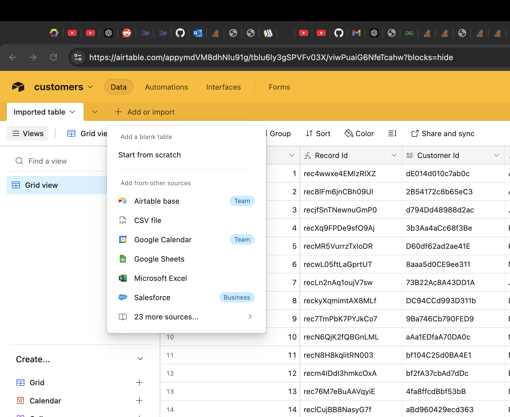
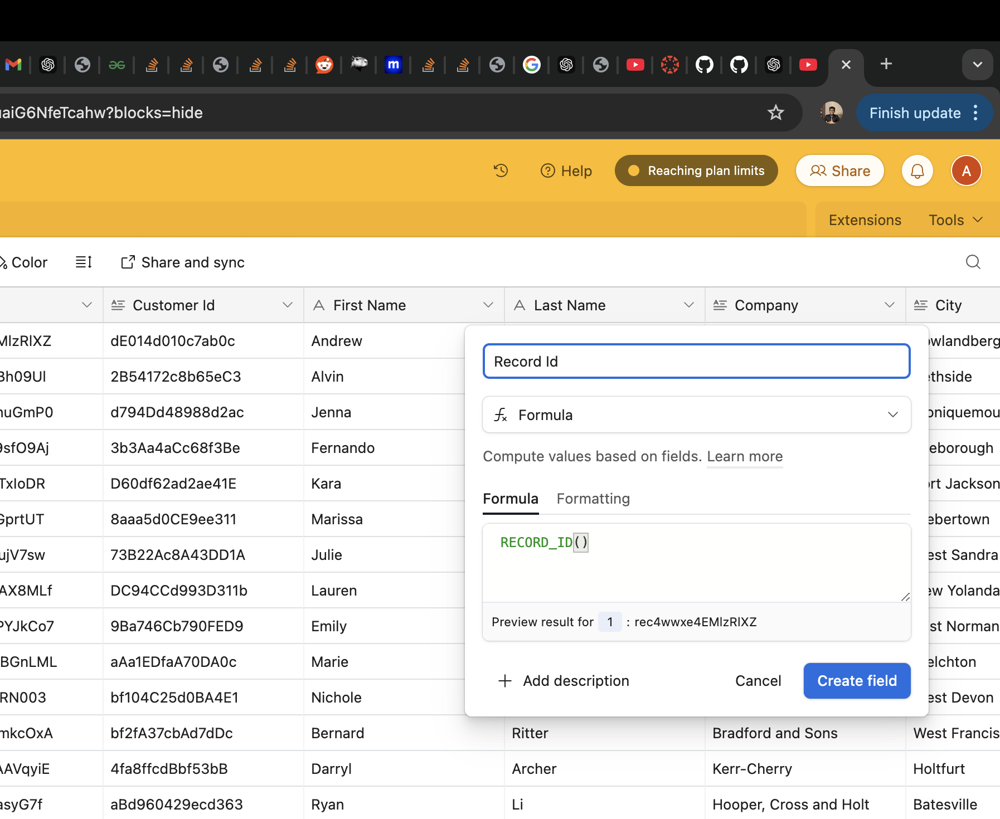
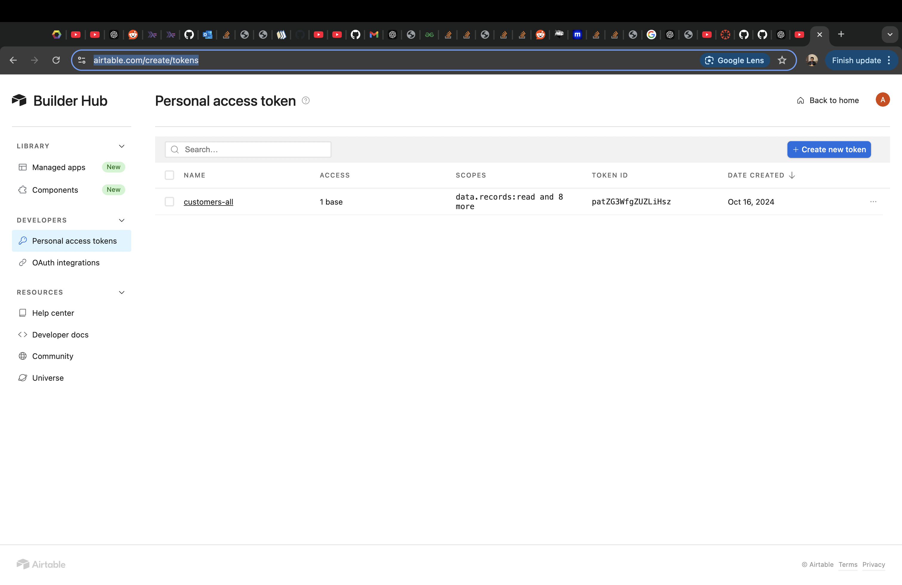
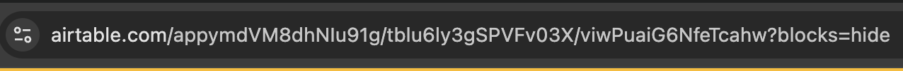

# Setup

Hey you guys. Welcome to the project. To get started with your first tasks, please read the setup instructions carefully:

- `git clone git@github.com:anish-dfg/scipio.git` (or, if you don't have SSH keys setup), `git clone https://github.com/anish-dfg/scipio.git`
- `cd` into the project directory and open it in your editor.
- Inspect a few files. Make sure that after `rust-analyzer` has indexed all the code, that you do not have any errors. If you do, please slack message me and we will figure it out together.

You will only be working in `scipio-airtable` for now. At a high level, you will help to implement a fully-featured Airtable client for Develop for Good, which will eventually be published as a standalone, open source library on crates.io. The reason you will be working on `scipio-airtable` is because:

- It is a single, self contained crate with no project dependencies
- It is critically valuable as Develop for Good interfaces with Airtable a lot, and building out more features is important as we continue to evolve as an organization because Airtable serves as the "frontend" to Develop for Good's Data. It's the source of truth.

To get started with development, you'll need to create an Airtable account. Once you do that, please create a base to work in. Next, navigate [here](https://www.datablist.com/learn/csv/download-sample-csv-files), scroll down to "Customers Dataset", then to "Download Customers Sample CSV Files". Download "customers-1000.csv".

<br/>

Use any method you want to slice the last 150 rows off the end of the CSV. A simple python script to do this is

```python
import pandas as pd

df = pd.read_csv("./customers-1000.csv")
df_sliced = df.iloc[:-150]
df_sliced.to_csv("customer-processed.csv", index=False)
```

It should output a file called `customer-processed.csv`. Just make sure to keep the python script right next to the file you want to process.
<br/>

Once you have that processed file, import it into your base . After it's imported, scroll to the far right and click the "+" icon to create a new column. It should look like the following . Make sure it's named the same as it is in the image.

<br/>

Next, you'll need an API token. Navigate to the [page to create tokens](https://airtable.com/create/tokens) and create a personal access token . Give it all the permissions you can. Make sure you have it saved for the next step - you can only view it once. In `scipio-airtable`, make a file called `.env`. Make the contents look something like this:

```bash
TEST_AIRTABLE_API_TOKEN="<your-token-from-the-previous-step>"
TEST_AIRTABLE_API_BASE="<your-airtable-base>"
TEST_AIRTABLE_API_TABLE="<your-airtable-table>"
TEST_AIRTABLE_API_VIEW="<your-airtable-view>"

TEST_AIRTABLE_API_RECORD_ID="<the-record-id-of-the-first-record-in-the-table>"
```

To get the base, table, and view, refer to the url path . The base id is the first url path parameter, table id is the second, and the view id is the third.

<br/>

Once you have completed all of these steps, please make sure you're inside `scipio-airtable` and run the following command:

- `cargo test --features=integration`

If everything works, you are all setup. If something doesn't work, please let me know and we will resolve it.

<br/>
A few other useful commands for testing that you might want are as follows:

- `cargo test --features="integration" <test-name>` // this will test a specific test
- `cargo test --features="integration" -- --nocapture` // this will print logs to stdout

You can combine flags. The incantation you're most likely to be running when testing the things you build yourself is:

- `cargo test --features="integration" <test-name> -- --nocapture`

Which will run a specific test case and print logs to stdout (useful for debugging!). Now, onto the actual tasks.

## Tasks Background

Please navigate to the [documentation page for the Airtable Web API](https://airtable.com/developers/web/api/introduction). The left hand sidebar contains documentation for specific web endpoints. Fundamentally, our end goal for this project is to implement _as much of the Airtable API as we can in Rust_. This entails:

- Being able to call endpoints ergonomically in our code, meaning it's easy to construct the request, and the data that we receive back is deserialized nicely into language structures. For example, a user should be able to call `airtable.get_record("some-record-id")?` and get a nice language structure back (instead of raw JSON). Inspect the existing functions (and tests!) inside `scipio-airtable` to get a sense of what this means.

<br/>

Take a moment to inspect the layout of `scipio-airtable`. The `lib.rs` and `retry.rs` files define the Airtable client as well as the retry logic for exponential backoffs with jitter. The `tests` directory contains tests. The `base_data` directory contains implementations of the Base Data endpoint specifications. Base Data is one of the headings in the left hand sidebar on the Airtable Web API Documentation page. If you are tasked with implementing an endpoint from a different sidebar heading, create a new directory called, for example, `permissions`, `org_management`, etc, unless the number of functions is small. If you are implementing a function in a subheading, for example Base Data -> Records, and there isn't already a file called `records.rs`, create it and write your code there. Every file which implements some functionality for the airtable client should define an `impl` block, for example:

```rust
impl Airtable {
    pub async fn some_function<TSomeGenericIfNeeded>(
        &self,
        // some params if needed
    ) -> Result<ListRecordsResponse<T> /* <- some return value*/>>
    where
      // some where clause if needed
    {
      todo!() // <- replace with your function body
    }
}
```

For example, if I ask you to implement a function called `update_record`, write something like

```rust
impl Airtable {
    pub async fn update_record<T>(
        &self,
        base_id: &str,
        table_id: &str,
        record_id: &str,
        data: T,
    ) -> Result<()>
    where
        T: for<'de> Deserialize<'de>,
    {
      todo!()
    }

}
```

and implement it. Update record actually exists in the codebase right now but it's just empty for now (one of you will do it). Ok, now that we've covered that, let's talk about how to develop.

### Forking, Cloning, and Branching

The steps for getting started with writing code are:

- Fork scipio
- Clone your fork to your local machine
- Create a new branch in the format: <your-name>/scipio-airtable<your-github-issue-number>. For example, if your name is Gabriel and the GitHub issue you're handling is called `#11`, create a new branch called `gabriel/scipio-airtable#11` using the command `git switch -c gabriel/scipio-airtable#11`
- Work on your new feature

When you are done (and have written tests), please make a pull request, at which point I will review your code and either merge it or tell you what to change before it can be merged.

### Specific tasks

For the first 2 weeks, the assignments are as follows:

- Gabriel, implement the `update_record` and `update_multiple_records` endpoints. Docs can be found [here](https://airtable.com/developers/web/api/update-record) and [here](https://airtable.com/developers/web/api/update-multiple-records).
- Mallika, implement the `create_records` endpoint. Docs can be found [here](https://airtable.com/developers/web/api/create-records)
- Nainoo, implement the `delete_record` and `delete_multiple_records` endpoints. Docs can be found [here](https://airtable.com/developers/web/api/delete-record) and [here](https://airtable.com/developers/web/api/delete-multiple-records)
- Stefan, implement the `update_table` endpoint. Docs can be found [here](https://airtable.com/developers/web/api/update-table)

For me to assign you to the issue, you need to navigate to the `issues` tab in GitHub for the `scipio` repository and comment on the issue that you're supposed to handle. Comment something like "I'd like to handle this" and I _believe_ I should be able to assign you. If I can't, it's not a huge deal because it's not a blocker or anything, but it's nice to document these things.

<br/>

If any part of these docs were unclear, please reach out to me via Slack so I can help you with what you need. Thanks for being here. I know each of you is very capable and I'm excited to work with you guys. :)
